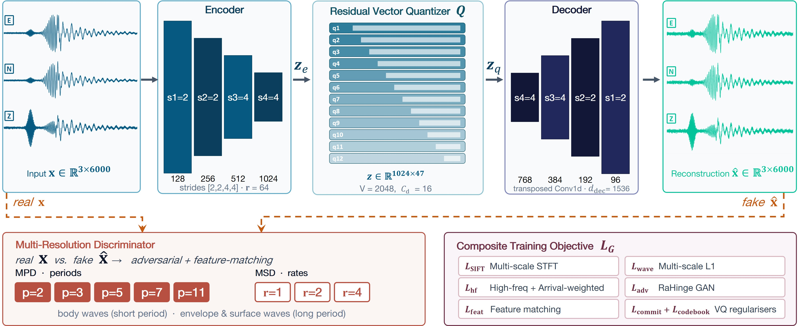

# SeisCodec

**VQ-VAE-based neural discrete representation learning for seismology.**

SeisCodec compresses three-component seismic waveforms into discrete tokens and reconstructs them with high fidelity, providing a tokenization interface for downstream sequence models.



## Install

```bash
pip install torch pytorch-lightning einops numpy matplotlib tqdm tensorboard seisbench
```

## Train

Point `--data_path` at a directory containing SeisBench datasets (one per subfolder):

```bash
python train.py --data_path ./seisBenchDatasets
```

## Evaluate

```bash
python validate_checkpoints.py --ckpt_dir logs/seis_codec/checkpoints
```

## Inference

```python
import torch
from model import SeisCodec

model = SeisCodec().eval()
blob = torch.load("checkpoint.ckpt", map_location="cpu", weights_only=False)
state = blob.get("ema_state_dict") or {
    k.removeprefix("model."): v for k, v in blob["state_dict"].items() if k.startswith("model.")
}
model.load_state_dict(state, strict=False)

x = torch.randn(2, 3, 6000)
with torch.no_grad():
    out = model(x)
print(out["codes"].shape, out["audio"].shape)
```


## Citation

> Yimin Dou and Xinan Wang. *SeisCodec: VQ-VAE-Based Neural Discrete Representation Learning for Seismology.*

## Acknowledgements

Builds on the [Descript Audio Codec](https://github.com/descriptinc/descript-audio-codec); data via [SeisBench](https://github.com/seisbench/seisbench).

